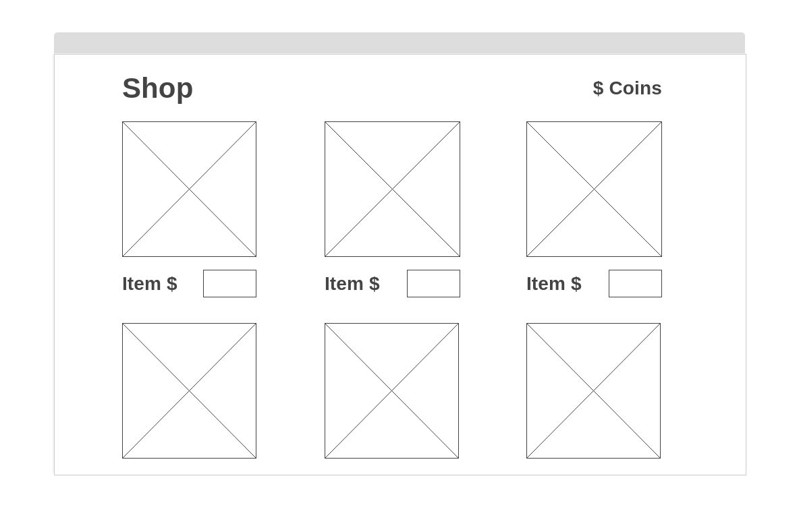
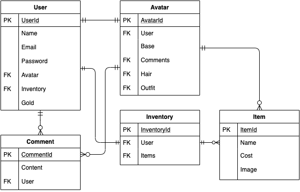

# Pixel Pals

## Overview
Pixel Pals is a web application inspired by the "virtual pet" and avatar-based social networks popularized in the early 2000s, the most well-known examples being Neopets and Gaia Online. Pixel Pals' immediate functionality will be much simpler than these complex websites, but its aim will be to capture the essence of these sites and provide users with a means of expressing themselves through a customizable avatar. Upon creating an account, users will be provided with a "pixel pal" which serves as their virtual pet/avatar on the site. Users can acquire different outfits and hairstyles for their pixel pal to better suit their own aesthetic, and then share their pixel pal with other users. 

### Features
- Personal and customizable avatar for each user
- Virtual currency acquired while navigating the site
- Shop page where avatar customization options can be purchased
- Gallery page where other avatars can be viewed
- Profile pages where users can comment

### Goals
- Provide users with a means of expressing themselves within a virtual community
- Simulate a virtual economy where fake currency holds some value for the user
- Offer a fun, casual experience where users can temporarily escape the "real world" and decompress

### Challenges
- Potentially very complex interactions between front-end and back-end
- Lots of assets will be required, time to produce custom-made images
- No readily available reference for most functionality

## MVP
To provide a minimum viable product, Pixel Pals will need to offer, at the very least, user accounts with customizable avatars which can be shared on the site. This will rely on a front-end client built in React, as well as a back-end server utilizing Ruby on Rails and a JSON RESTful API.

### Wireframes

_Inventory_

_Shop_

_Gallery_

_Profile_


### Components

``` structure

src
|__ assets/
      |__ images
|__ components/
      |__ Header.jsx
      |__ Avatar.jsx
      |__ Profile.jsx
      |__ Shop.jsx
      |__ Gallery.jsx
      |__ Inventory.jsx
      |__ Currency.jsx
      |__ Comment.jsx
|__ services/

```

|  Component   |    Type    | state | props | Description                                                      |
| :----------: | :--------: | :---: | :---: | :--------------------------------------------------------------- |
|    Header    | functional |   n   |   n   | _The header will contain the navigation and logo._               |
|  Avatar      | class      |   y   |   y   | _The avatar will contain the user's avatar image._               |
|  Profile     | class      |   y   |   y   | _The profile will render a user's profile._                      |
|  Shop        |  class     |   y   |   y   | _The shop will handle user purchases of new avatar items._       |
|   Gallery    |   class    |   y   |   n   | _The gallery will render all avatars using cards in flexbox._    |
| Inventory    | class      |   y   |   y   | _The inventory will contain all items owned by the user._        |
|    Currency  | class      |   y   |   y   | _The currency will show the user's currency and any updates._    |
| Comment      | class      |   y   |   y   | _The comment will contain the form for a profile comment._       |

### ERD Model



### Data Hierarchy

``` structure

pixelpals_db
|__ users/
|__ avatars/
|__ items/

```

### Dependencies

|     Library      | Description                                |
| :--------------: | :----------------------------------------- |
|      React       | _Used for front-end client._               |
|   React Router   | _Navigation and conditional rendering._    |
|     Axios        | _Access data in React from the back-end._  |
|  Ruby on Rails   | _Building back-end database/API._          |
|  Bcrypt/JWT      | _Password encryption and user auth._       |

## Post-MVP
Future goals for this project are to incorporate more interactivity for the user. The project could expand into a fully-realized virtual pet simulator or incorporate other game-like elements to provide users with a sense of progression and purpose. There are a large number of possibilities for expansion of this project, but a select few priorities are listed below.

### Stretch Goals
- Increase the number of available customization options for avatars.
- Implement a reward system such as games or challenges which allow for users to acquire rare items.
- Incorporate a barter system where users can trade items with other users.
- Include statistics for each pixel pal, requiring the user to feed and care for them, as well as the option to battle them.


